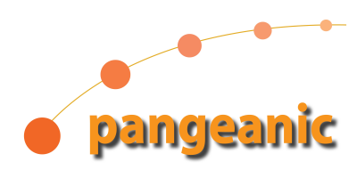

 <!-- .element height="40%" width="40%" -->

## PangeaMasker: Adaptive Anonymiser

##### Slides for [SwissText 2021](https://www.swisstext.org/), June 16

##### [Abel Meneses-Abad](https://www.linkedin.com/in/meneses-abad/) & [Mercedes García-Martínez](https://www.linkedin.com/in/mercedes-garc%C3%ADa-mart%C3%ADnez-8194ba49/)

###### [Ozkar L. Garcell \\ Amando Estela, Laurent Bié, Aleix Cerdà, Ernesto Rodríguez, Manuel Herranz]()
________________________

###### Get slides [source code](https://github.com/sorice/paraph-text-reuse-slides)

###### Under [Attribution 4.0 International](http://creativecommons.org/licenses/by/4.0/) License.

---

### About Speaker

- ML Engineer on Pangeanic from 2020, Spain
- ML Engineer on Datwit from 2019, Serbia
- ML practicioner from 2017 on Datwit, WhiteTower, Thelos, USA
- Until 2017 PhD candidate in the field of NLP, UCLV, Cuba
- 2009-13 Director of Center for Studies of FLOSS Applications in Society, Cuba
- 2009 Chairman of Free Software Committee, Informatica-Habana 2009

---

## What is all about?

- PangeaMasker the Automatic Anonymisation Toolkit
- Neural Named Entity Recognition (NER)
- Web Applications to improve the Anonymisation
  * ECO: Pangeanic Web Platform for Language Services
  * PECAT: Web Human-Annotation Toolking to improve automatic labeling
  * Anonymisation Services details
- Spanish Resources & Experiments.
  * Conll2003 experiment
  * Conll2003 + Human Labeled Data
  * Conll + HLD + PangeaMasker Refining flow
- Conclusions

---

## PangeaMasker Roadmap

---

## Results

---

## Conclusions
